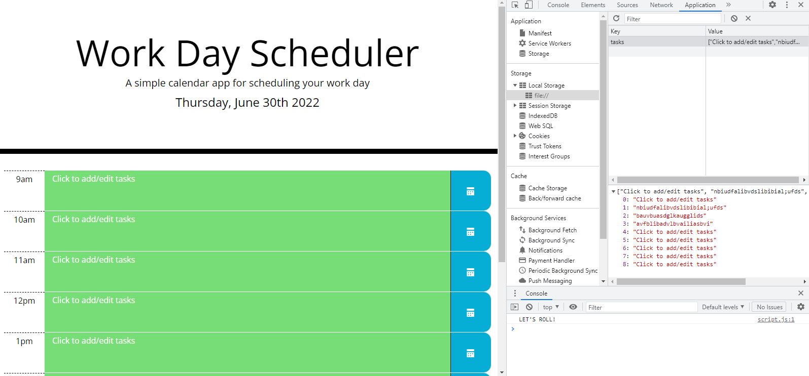

# work-day-scheduler
A daily scheduling app using JS and CSS libraries

## Link 
https://eclevela-1234.github.io/work-day-scheduler/

## Topics Learned
* jQuery, jQuery, jQuery
* Bootstrap CSS, Bootstrap Utilities
* moment.js

## Final Thoughts
I struggled to get motivated for this one but I'm glad I did. jQuery proved to be quite efficient at building DOM elements. I also deepened my understanding of Bootstrap. Learning all new syntaxes for various libraries for the fifth week in a row pushed me to rely on documentation, and therefore get better at learning from it and researching.

**Proud Moment! -** Figuting out how to trigger the save button when it was in conflict with a blur event and successfully storing the textarea data to localstorage.
**Another Note -** I was supremely annoyed, after having finished commenting and cleaning the codebase, to realize a styling issue (relating to the hard coded p elements) had cropped up seemingly from nowhere. After further inspection, I realized that dynamically created elements did not have the issue so I just created them all on page load. 

